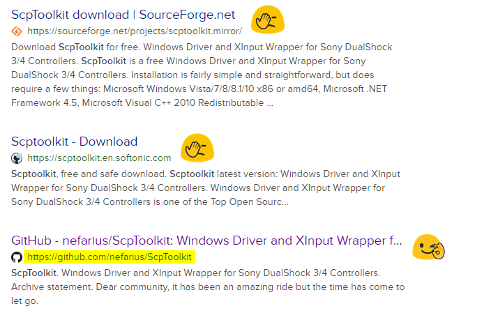

# ScpToolkit

Windows Driver and XInput Wrapper for Sony DualShock 3/4 Controllers

---

## 🔥 OBSOLESCENCE NOTICE 🔥

> Dear community, it has been an amazing ride but the time has come to let go. The ScpToolkit has outgrown itself and won't be continued any longer. You're still welcome to continue using it if it fits your needs, just don't expect any support, fixes or new features from the original developers.

## 📘 FURTHER INFORMATION 📘

👉 [Archival statement](https://forums.vigem.org/topic/252/here-is-the-news#scptoolkit-is-still-dead)

👉 [**Removal guide**](https://vigem.org/projects/ScpToolkit/ScpToolkit-Removal-Guide/)

## ⚠️ SHADY CLONES ⚠️

With rising popularity of this project came the leeches 😉 The **only official authentic download location is (and always was) here on GitHub:** [`https://github.com/nefarius/ScpToolkit/releases`](https://github.com/nefarius/ScpToolkit/releases)

Any other site claiming to host, support, extend or continue ScpToolkit is **unofficial** and is not endorsed by the original developers. Some example search results:

You have been warned 🙃

---

## Credits

### Community

- Major props to [original author Scarlet.Crush](http://forums.pcsx2.net/User-Scarlet-Crush) for developing this awesome toolkit!
- [Original PCSX2 forums thread](http://forums.pcsx2.net/Thread-XInput-Wrapper-for-DS3-and-Play-com-USB-Dual-DS2-Controller)

### Sponsors

- ScpToolkit´s Setup is created with [Advanced Installer](http://www.advancedinstaller.com/), a feature-rich and yet easy to learn installation package creation framework for the Windows platform.
- Development is assisted by [JetBrains ReSharper Ultimate](https://www.jetbrains.com/dotnet/) tool collection, a must-have for every serious .NET developer.

### Used libraries and other 3rd party code

- [MadMilkman.Ini parsing library by Mario Z.](https://github.com/MarioZ/MadMilkman.Ini)
- [reactivesockets library by Daniel Cazzulino](https://github.com/clariuslabs/reactivesockets)
- [Windows Driver Installer library for USB devices](https://github.com/pbatard/libwdi)
- [PortableSettingsProvider](https://github.com/crdx/PortableSettingsProvider)
- [log4net logging library](https://logging.apache.org/log4net/)
- [Libarius .NET library](https://github.com/nefarius/Libarius)
- [Rx networking library](https://github.com/clariuslabs/reactivesockets)
- [libusbK driver package](https://code.google.com/p/usb-travis/)
- [irrKlang cross platform sound library](http://www.ambiera.com/irrklang/index.html)
- [Metro Light and Dark Themes for WPF](http://brianlagunas.com/free-metro-light-and-dark-themes-for-wpf-and-silverlight-microsoft-controls/)
- [Fody/PropertyChanged](https://github.com/Fody/PropertyChanged)
- `ScpCleanWipe` uses code from [DriverStore Explorer](https://driverstoreexplorer.codeplex.com/)
- [AutoDependencyProperty.Fody](http://blog.angeloflogic.com/2014/12/no-more-dependencyproperty-with.html)
- [HIDSharp library](http://www.zer7.com/software/hidsharp)
- [Windows Input Simulator](http://inputsimulator.codeplex.com/)
- [AutoDependencyProperty.Fody](http://blog.angeloflogic.com/2014/12/no-more-dependencyproperty-with.html)
- [LoadAssembliesOnStartup](https://github.com/Fody/LoadAssembliesOnStartup)
- [Costura](https://github.com/Fody/Costura/)
- [DBreeze NoSql embedded object DBMS](https://dbreeze.codeplex.com/)
- [Newtonsoft.Json](https://github.com/JamesNK/Newtonsoft.Json)

## Installation requirements

- Microsoft Windows Vista/7/8/8.1/10 x86 or amd64
- [Microsoft .NET Framework 4.5](https://www.microsoft.com/en-US/download/details.aspx?id=42642)
- [Microsoft Visual C++ 2010 Redistributable Package](http://www.microsoft.com/en-US/download/details.aspx?id=5555)
- [Microsoft Visual C++ 2013 Runtime](https://www.microsoft.com/en-US/download/details.aspx?id=40784)
- [DirectX Runtime](https://www.microsoft.com/en-us/download/details.aspx?DisplayLang=en&id=35)
- [Xbox 360 Controller driver](https://www.microsoft.com/accessories/en-us/products/gaming/xbox-360-controller-for-windows/52a-00004#techspecs-connect)
  - Already integrated in Windows 8.x or greater
- At least one supported Sony DualShock 3/4 controller (see **Compatible Controllers**)
- Administrator rights *during driver setup*

### Optional

- A supported Bluetooth 2.0 (or higher) compatible USB dongle **with EDR** (**E**nhanced **D**ata **R**ate)
  - See [**Compatible Bluetooth Devices**](https://github.com/nefarius/ScpToolkit/wiki/Compatible-Bluetooth-Devices)
- For DS4s to be useable the minimal supported Bluetooth version is **2.1**!
